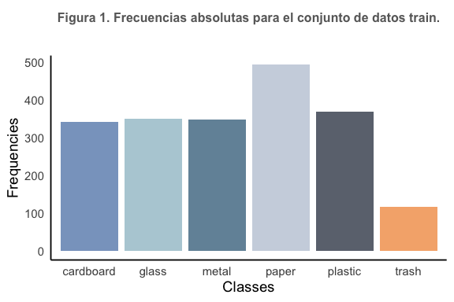
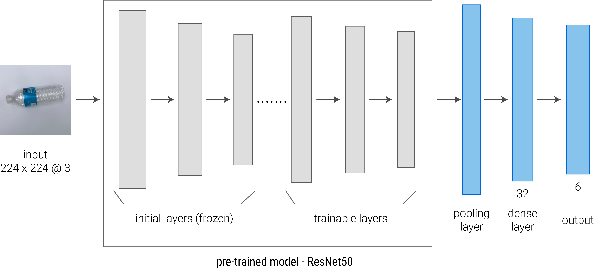
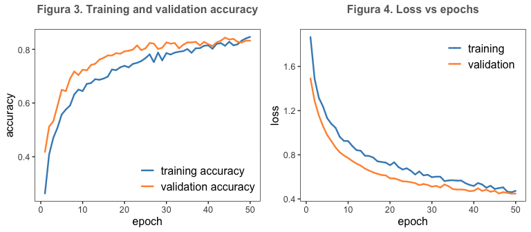
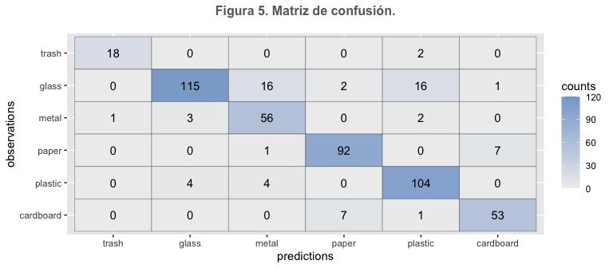

### 1. Problema a resolver

El fenómeno del cambio climático ha planteado la necesidad de buscar estrategias para contrarrestar sus efectos, entre las cuales se encuentra el reciclaje. Este forma parte de lo que se denomina una economía circular la cual busca optimizar recursos y así reducir el impacto ambiental. Ciertamente, el reciclaje contribuye al ahorro de recursos naturales al reutilizar los items reciclados y a la reducción de la cantidad de emisiones de gases de efecto invernadero. De acuerdo a  datos oficiales de la ONU, solo se ha reciclado un 9% de todo el desecho plástico producido a lo largo del tiempo, un 12% de los desechos ha sido incinerado, mientras que  el 79%  de lo restante ha terminado en vertederos, basureros e incluso en el medio ambiente.  En la actualidad, varios países han adoptado medidas de reciclaje que involucran la implantación de contenedores para reciclar los residuos. Asimismo, se han realizado campañas de difusión para que las personas aprendan a separar los residuos y así reciclarlos de una manera eficiente. A pesar de que las organizaciones han implementado los sistemas de reciclaje, aún existe desconocimiento por parte de las personas sobre cómo separar los residuos.  Debido a esto es importante buscar maneras de cómo clasificar los residuos efectivamente. La solución propuesta involucra la implementación de una aplicación que indica donde depositar los items a reciclar.  Las organizaciones pueden utilizar esta aplicación en un dispositivo móvil que se encuentre cerca de los contenedores y así las personas sólo tendrían que tomar una foto del item. Asimismo las personas podrían instalar la aplicación en sus teléfonos de tal manera que puedan desechar los residuos en otros contenedores.

### 2. Procesamiento de datos 
<!--y explicación de las variables y tablas ### 3. Manipulación de datos -->

El conjunto de datos se encuentra en el sitio web de Kaggle [(Garbage classification)](https://www.kaggle.com/asdasdasasdas/garbage-classification). La data consiste en 2527 imágenes pertenecientes a 6 categorias. Las imágenes tienen un tamaño de 512 x 384 pixeles. La tabla 1 detalla el número total de imágenes por cada clase. 

<table class="table" style="width: auto !important; margin-left: auto; margin-right: auto;">
<caption>Tabla 1. Resumen de datos.</caption>
 <thead>
  <tr>
   <th style="text-align:right;"> Categorías </th>
   <th style="text-align:right;"> No. de imágenes </th>
  </tr>
 </thead>
<tbody>
  <tr>
   <td style="text-align:right;"> trash </td>
   <td style="text-align:right;"> 137 </td>
  </tr>
  <tr>
   <td style="text-align:right;"> glass </td>
   <td style="text-align:right;"> 491 </td>
  </tr>
  <tr>
   <td style="text-align:right;"> metal </td>
   <td style="text-align:right;"> 400 </td>
  </tr>
  <tr>
   <td style="text-align:right;"> paper </td>
   <td style="text-align:right;"> 584 </td>
  </tr>
  <tr>
   <td style="text-align:right;"> plastic </td>
   <td style="text-align:right;"> 472 </td>
  </tr>
  <tr>
   <td style="text-align:right;"> cardboard </td>
   <td style="text-align:right;"> 393 </td>
  </tr>
</tbody>
</table>
Posteriormente se procedió a dividir el conjunto de datos en dos partes (80/20) para el entrenamiento (train) y prueba (test) del modelo. La tabla 2 presenta los dos conjuntos de datos obtenidos después de la partición. Se puede evidenciar que la mayoría de las clases presentan un número similar de muestras para el conjunto de entrenamiento, excepto por la categoría "trash" como se muestra en la Figura 1.

<table class="table" style="width: auto !important; margin-left: auto; margin-right: auto;">
<caption>Tabla 2. División de datos</caption>
 <thead>
<tr>
<th style="empty-cells: hide;border-bottom:hidden;" colspan="1"></th>
<th style="border-bottom:hidden;padding-bottom:0; padding-left:3px;padding-right:3px;text-align: center; " colspan="2">
Partición
</th>
</tr>
  <tr>
   <th style="text-align:right;"> Class </th>
   <th style="text-align:right;"> Train </th>
   <th style="text-align:right;"> Test </th>
  </tr>
 </thead>
<tbody>
  <tr>
   <td style="text-align:right;"> trash </td>
   <td style="text-align:right;"> 117 </td>
   <td style="text-align:right;"> 20 </td>
  </tr>
  <tr>
   <td style="text-align:right;"> glass </td>
   <td style="text-align:right;"> 351 </td>
   <td style="text-align:right;"> 150 </td>
  </tr>
  <tr>
   <td style="text-align:right;"> metal </td>
   <td style="text-align:right;"> 348 </td>
   <td style="text-align:right;"> 62 </td>
  </tr>
  <tr>
   <td style="text-align:right;"> paper </td>
   <td style="text-align:right;"> 494 </td>
   <td style="text-align:right;"> 100 </td>
  </tr>
  <tr>
   <td style="text-align:right;"> plastic </td>
   <td style="text-align:right;"> 370 </td>
   <td style="text-align:right;"> 112 </td>
  </tr>
  <tr>
   <td style="text-align:right;"> cardboard </td>
   <td style="text-align:right;"> 342 </td>
   <td style="text-align:right;"> 61 </td>
  </tr>
</tbody>
</table>

<!-- -->

Dado que el conjunto de datos no estaba balanceado se generaron nuevas muestras para la clase "trash". Para esto se utilizó la técnica de data augmentation que involucra modificar la apariencia de la imágen en base a ciertas propiedades. En total se realizaron 6 transformaciones sobre un subconjunto de 40 imágenes. Dichas transformaciones consistian en: rotar imagen, ajustar contraste, ajustar brillo y recortar imagen. Como resultado se agregó 240 imágenes a la clase "trash" dando un total de 357 imágenes. Finalmente, el tamaño del conjunto de datos para el entrenamiento se amplio a 2764 imágenes, mientras que el conjunto de prueba contiene 505 imágenes.

<!-- ### 4. Análisis Exploratorio de datos (tablas de frecuencias y gráficos, sólo lo necesario para entender el problema, no se requiere uno para cada variable, pueden usar la librería ggally para resumir)-->

### 3. Solución del problema

<!--Breve descripción de cómo se espera resolver el problema (por ejemplo, indicar que el problema es de clasificación supervisada, por lo que se va a usar regresión logística y rnn)
### 6. Preprocesamiento

### 7. Particionamiento Train-Test y estrategia de remuestreo o de validación-->

El problema a resolver es de clasificación de imágenes las cuales se encuentran almacenadas en directorios que permiten distinguer las clases. La solución propuesta utiliza _redes neuronales_ para generar un modelo capaz de predecir el tipo de material de un ítem dada una imagen. En particular, se utiliza la técnica de _transfer learning_ que involucra el uso de un modelo pre-entrenado para facilitar el aprendizaje sobre las distintas características de las imágenes. Posteriormente se aplica la técnica de _fine tuning_ sobre las últimas capas del modelo pre-entrenado para mejorar el desempeño del modelo y evitar el sobreajuste.

### 4. Entrenamiento y ajuste de hiperparámetros

Previo al entrenamiento del modelo, se realizó la conversión de las etiquetas (clases) en un formato binario utilizando el método _One Hot Encoding_. Por otro lado, se aplicó un método de _data augmentation_ sobre el conjunto de datos train para generar distintas muestras durante el entrenamiento. En particular, se realizan 7 transformaciones de forma aleatoria como rotar, voltear, y aumentar zoom. En cuanto al modelo pre-entrenado, se seleccionó el modelo [ResNet50V2](https://keras.io/api/applications/resnet/#resnet50v2-function) para aplicar la técnica transfer learning en el conjunto de datos.

En cuanto a los hiperparámetros, se seleccionó los siguientes valores para construir el modelo: un batch_size de 32, y un número de epochs de 50. Se realizó pruebas con varios optimizadores incluyendo Adam y RMS, pero el mejor resultado se obtuvo utilizando SGD con una tasa de aprendizate (learning rate) de 1e-4.

<!--train dataset = rotation, width_shit/, height_range, zoom_range, shear_range, vertical_flip, horizontal_flip-->
<!--Comparación de técnicas -->

### 5. Construcción del modelo

La construcción del modelo se realizó en varias fases en las cuales se evaluaron diferentes técnicas. En particular, se crearon modelos combinando 3 técnicas: data augmentation, transfer learning y fine tuning. La tabla 3 presenta el resumen de los modelos evaluados. Primero, se generó un modelo simple utilizando una red neuronal convolucional de 5 capas junto con data augmentation. Se puede observar que este modelo requiere menos parametros para entrenar (852.518) de entre todos los modelos evaluados. Sin embargo, al utilizar esta arquitectura se obtiene un menor valor de accuracy (0.70) y un valor de loss alto (0.7934). Segundo, se crearon modelos utilizando ResNet50V2 en los cuales se obtuvo valores de accuracy superiores a 0.80 y valores de loss menores a 0.55. La diferencia en los modelos se centra en aplicar o no las técnicas mencionadas, lo cual se puede evidenciar en el número de parámetros a entrenar. Es importante mencionar que los modelos basados en ResNet50V2 aplican capas Dropout como técnica de regularización. El mejor resultado se obtuvo cuando se aplicó las 3 técnicas en conjunto con el método de regularización L2 (ridge regression). Los resultados muestran que el modelo se desempeña mejor en la tarea de clasificación al obtener valores de accuracy y loss de 0.88 y 0.40 respectivamente.

<table class="table" style="width: auto !important; margin-left: auto; margin-right: auto;">
<caption>Tabla 3. Comparación de modelos creados a partir de combinar técnicas.</caption>
 <thead>
  <tr>
   <th style="text-align:left;"> Model </th>
   <th style="text-align:left;"> Params </th>
   <th style="text-align:left;"> Trainable params </th>
   <th style="text-align:left;"> Non-trainable params </th>
   <th style="text-align:left;"> Accuracy </th>
   <th style="text-align:left;"> Loss </th>
  </tr>
 </thead>
<tbody>
  <tr>
   <td style="text-align:left;"> Arquitectura simple - data augmentation </td>
   <td style="text-align:left;"> 852.818 </td>
   <td style="text-align:left;"> 852.518 </td>
   <td style="text-align:left;"> 0 </td>
   <td style="text-align:left;"> 0.7090 </td>
   <td style="text-align:left;"> 0.7934 </td>
  </tr>
  <tr>
   <td style="text-align:left;"> ResNet50V2 - no data augmentation - fine tuning </td>
   <td style="text-align:left;"> 126.854.150 </td>
   <td style="text-align:left;"> 126.808.710 </td>
   <td style="text-align:left;"> 45.440 </td>
   <td style="text-align:left;"> 0.8653 </td>
   <td style="text-align:left;"> 0.5177 </td>
  </tr>
  <tr>
   <td style="text-align:left;"> ResNet50V2 - data augmentation - no fine tuning </td>
   <td style="text-align:left;"> 126.854.150 </td>
   <td style="text-align:left;"> 103.289.350 </td>
   <td style="text-align:left;"> 23.654.800 </td>
   <td style="text-align:left;"> 0.8350 </td>
   <td style="text-align:left;"> 0.5477 </td>
  </tr>
  <tr>
   <td style="text-align:left;"> ResNet50V2 - data augmentation - fine tuning </td>
   <td style="text-align:left;"> 23.630.566 </td>
   <td style="text-align:left;"> 3.481.830 </td>
   <td style="text-align:left;"> 20.148.736 </td>
   <td style="text-align:left;"> 0.8670 </td>
   <td style="text-align:left;"> 0.4211 </td>
  </tr>
</tbody>
</table>

La Figura 2 presenta a mayor detalle la arquitectura creada para clasificar los residuos a reciclar. Al utilizar un modelo pre-entrenado es importante que la imágen tenga las mismas dimensiones. En particular, ResNet50V2 funciona con imágenes de tamaño 224 x 224 pixeles. Por lo tanto, se realiza un redimensionamiento de las imágenes previo al entrenamiento. Por otro lado, la solución propuesta emplea la técnica fine tuning la cual involucra entrenar cierto número de capas (trainable-layers) del modelo pre-entrenado por lo que estas pueden aprender otras características sobre el conjunto de imágenes. En particular, se realiza un entrenamiento sobre las 10 últimas capas de ResNet50V2. Finalmente, se agregan tres capas (pooling layer, dense layer y output) para reducir el tamaño de las salidas y así obtener una salida de tamaño 6.

  
Figura 2. Arquitectura creada para clasificar residuos

  

<!--(de ser necesario), selección o construcción del modelo final.-->

### 6. Resultados finales 

Esta sección describe los resultados obtenidos para el modelo propuesto. La figura 3 presenta la exactitud (accuracy) del modelo en función del número de epocas (epochs). Los resultados muestran un incremento de la exactitud a lo largo de las iteraciones. En particular, el conjunto de datos de prueba (validation) obtiene un accuracy de 0.5, el cual se incrementa gradualmente hasta alcanzar un valor de 0.87. Una tendencia similar se obtiene para el conjunto de datos de entrenamiento (train), el cual obtiene un valor inicial de 0.3 hasta alcanzar un accuracy de 0.85. La figura 4 presenta la pérdida (loss) en función de las epocas. Para ambos conjuntos de datos, se obtienen valores de pérdida superiores a 1, sin embargo a lo largo de las épocas se consigue una notable mejoria en el modelo al alcanzar valores cercanos 0.4 para ambos conjuntos de datos.

 A continuación se reporta el desempeño del modelo para cada una de las métricas utilizadas en problemas de clasificación. La tabla 3 presenta el reporte de clasificación para el modelo obtenido. En términos de precisión (precision), se puede observar que en la mayoria de los casos el modelo predice correctamente las clases (un 80% de las veces), a excepción de la clase "metal" en la cual el modelo predice con un 73% de precisión. Para el caso de la exhaustividad (recall), se observa un comportamiento similar con valores superiores a 85%. Por otro lado, el modelo es capaz de identificar un 77% de las muestras que pertenecen a la clase "glass". En general, los resultados indican que el modelo puede predecir correctamente para la mayoría de los casos.
 
<table class="table" style="width: auto !important; margin-left: auto; margin-right: auto;">
<caption>Tabla 3. Reporte de clasificación.</caption>
 <thead>
  <tr>
   <th style="text-align:right;"> class </th>
   <th style="text-align:right;"> precision </th>
   <th style="text-align:right;"> recall </th>
   <th style="text-align:right;"> f1-score </th>
   <th style="text-align:right;"> support </th>
  </tr>
 </thead>
<tbody>
  <tr>
   <td style="text-align:right;"> trash </td>
   <td style="text-align:right;"> 0.95 </td>
   <td style="text-align:right;"> 0.9 </td>
   <td style="text-align:right;"> 0.92 </td>
   <td style="text-align:right;"> 20 </td>
  </tr>
  <tr>
   <td style="text-align:right;"> glass </td>
   <td style="text-align:right;"> 0.94 </td>
   <td style="text-align:right;"> 0.77 </td>
   <td style="text-align:right;"> 0.85 </td>
   <td style="text-align:right;"> 150 </td>
  </tr>
  <tr>
   <td style="text-align:right;"> metal </td>
   <td style="text-align:right;"> 0.73 </td>
   <td style="text-align:right;"> 0.9 </td>
   <td style="text-align:right;"> 0.81 </td>
   <td style="text-align:right;"> 62 </td>
  </tr>
  <tr>
   <td style="text-align:right;"> paper </td>
   <td style="text-align:right;"> 0.91 </td>
   <td style="text-align:right;"> 0.92 </td>
   <td style="text-align:right;"> 0.92 </td>
   <td style="text-align:right;"> 100 </td>
  </tr>
  <tr>
   <td style="text-align:right;"> plastic </td>
   <td style="text-align:right;"> 0.83 </td>
   <td style="text-align:right;"> 0.93 </td>
   <td style="text-align:right;"> 0.88 </td>
   <td style="text-align:right;"> 112 </td>
  </tr>
  <tr>
   <td style="text-align:right;"> cardboard </td>
   <td style="text-align:right;"> 0.87 </td>
   <td style="text-align:right;"> 0.87 </td>
   <td style="text-align:right;"> 0.87 </td>
   <td style="text-align:right;"> 61 </td>
  </tr>
  <tr>
   <td style="text-align:right;">  </td>
   <td style="text-align:right;">  </td>
   <td style="text-align:right;">  </td>
   <td style="text-align:right;">  </td>
   <td style="text-align:right;">  </td>
  </tr>
  <tr>
   <td style="text-align:right;"> **accuracy** </td>
   <td style="text-align:right;">  </td>
   <td style="text-align:right;">  </td>
   <td style="text-align:right;"> 0.87 </td>
   <td style="text-align:right;"> 505 </td>
  </tr>
  <tr>
   <td style="text-align:right;"> **macro avg** </td>
   <td style="text-align:right;"> 0.87 </td>
   <td style="text-align:right;"> 0.88 </td>
   <td style="text-align:right;"> 0.87 </td>
   <td style="text-align:right;"> 505 </td>
  </tr>
  <tr>
   <td style="text-align:right;"> **weighted avg** </td>
   <td style="text-align:right;"> 0.88 </td>
   <td style="text-align:right;"> 0.87 </td>
   <td style="text-align:right;"> 0.87 </td>
   <td style="text-align:right;"> 505 </td>
  </tr>
</tbody>
</table>

La Figura 5 presenta la matriz de confusión obtenida por el modelo utilizando el conjunto de datos de prueba. En general, se puede observar que el modelo predice correctamente para cada una de las clases, lo cual es consistente con los resultados presentados anteriormente. En ciertos casos se puede distinguir que para el caso de las clases "metal" y "plastic", el modelo tiende a clasificar ciertas muestras (16 en ambas casos) como "glass". Asimismo, el modelo clasifica ciertas muestras pertenecientes a las clases "glass" y "metal" como "plastic" (4 en ambos casos). Una posible explicación para estos resultados es por el brillo y contraste en las imágenes que puede causar confusión al determinar el material (clase) del ítem.

### 7. Conclusiones
* El modelo puede clasificar los items a reciclar con una exactitud del 88%.
* La técnica de data augmentation fue utilizada para resolver el problema de data no balanceada en el conjunto de datos.
* La solución propuesta utiliza técnicas como transfer learning y fine tuning las cuales permiten obtener mejores resultados en el entrenamiento del modelo.
* El uso de técnicas de regularización en capas como Dropout y L2 fue útil para reducir el sobreajuste en el modelo.

