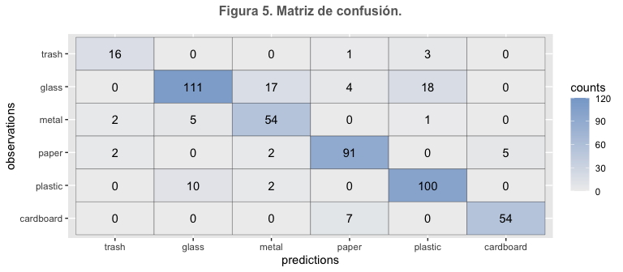

Clasificación de residuos para reciclaje
================
Lorena Montoya Freire

### 1\. Problema a resolver

El fenómeno del cambio climático ha planteado la necesidad de buscar
estrategias para contrarrestar sus efectos, entre las cuales se
encuentra el reciclaje. Este forma parte de lo que se denomina una
economía circular la cual busca optimizar recursos y así reducir el
impacto ambiental. Ciertamente, el reciclaje contribuye al ahorro de
recursos naturales al reutilizar los items reciclados y a la reducción
de la cantidad de emisiones de gases de efecto invernadero. De acuerdo a
datos oficiales de la ONU, solo se ha reciclado un 9% de todo el desecho
plástico producido a lo largo del tiempo, un 12% de los desechos ha sido
incinerado, mientras que el 79% de lo restante ha terminado en
vertederos, basureros e incluso en el medio ambiente. En la actualidad,
varios países han adoptado medidas de reciclaje que involucran la
implantación de contenedores para reciclar los residuos. Por otro lado,
se han realizado campañas de difusión para que las personas aprendan a
separar los residuos y así reciclarlos de una manera eficiente. A pesar
de que las organizaciones han implementado los sistemas de reciclaje,
aún existe desconocimiento por parte de las personas sobre cómo separar
los residuos. Debido a esto es importante buscar maneras de cómo
clasificar los residuos efectivamente. La solución propuesta consiste en
la implementación de una aplicación que indica donde depositar los items
a reciclar. Las organizaciones pueden utilizar esta aplicación en un
dispositivo móvil que se encuentre cerca de los contenedores y así las
personas sólo tendrían que tomar una foto del item. Además las personas
podrían instalar la aplicación en sus teléfonos de tal manera que puedan
desechar los residuos en otros contenedores.

### 2\. Procesamiento de datos

El conjunto de datos se encuentra en el sitio web de Kaggle [(Garbage
classification)](https://www.kaggle.com/asdasdasasdas/garbage-classification).
La data consiste en 2477 imágenes pertenecientes a 6 categorias. Las
imágenes tienen un tamaño de 512 x 384 pixeles. La tabla 1 detalla el
número total de imágenes por cada clase.

<table class="table" style="width: auto !important; margin-left: auto; margin-right: auto;">

<caption>

Tabla 1. Resumen de datos.

</caption>

<thead>

<tr>

<th style="text-align:right;">

Categorías

</th>

<th style="text-align:right;">

No. de imágenes

</th>

</tr>

</thead>

<tbody>

<tr>

<td style="text-align:right;">

trash

</td>

<td style="text-align:right;">

137

</td>

</tr>

<tr>

<td style="text-align:right;">

glass

</td>

<td style="text-align:right;">

491

</td>

</tr>

<tr>

<td style="text-align:right;">

metal

</td>

<td style="text-align:right;">

400

</td>

</tr>

<tr>

<td style="text-align:right;">

paper

</td>

<td style="text-align:right;">

584

</td>

</tr>

<tr>

<td style="text-align:right;">

plastic

</td>

<td style="text-align:right;">

472

</td>

</tr>

<tr>

<td style="text-align:right;">

cardboard

</td>

<td style="text-align:right;">

393

</td>

</tr>

</tbody>

</table>

Posteriormente, se procedió a dividir el conjunto de datos en dos partes
(80/20) para el entrenamiento (train) y prueba (test) del modelo. La
tabla 2 presenta los dos conjuntos de datos obtenidos después de la
partición. Se puede evidenciar que la mayoría de las clases presentan un
número similar de muestras para el conjunto de entrenamiento, excepto
por la categoría “trash” como se muestra en la Figura 1.

<table class="table" style="width: auto !important; margin-left: auto; margin-right: auto;">

<caption>

Tabla 2. División de datos

</caption>

<thead>

<tr>

<th style="empty-cells: hide;border-bottom:hidden;" colspan="1">

</th>

<th style="border-bottom:hidden;padding-bottom:0; padding-left:3px;padding-right:3px;text-align: center; " colspan="2">

Partición

</th>

</tr>

<tr>

<th style="text-align:right;">

Class

</th>

<th style="text-align:right;">

Train

</th>

<th style="text-align:right;">

Test

</th>

</tr>

</thead>

<tbody>

<tr>

<td style="text-align:right;">

trash

</td>

<td style="text-align:right;">

117

</td>

<td style="text-align:right;">

20

</td>

</tr>

<tr>

<td style="text-align:right;">

glass

</td>

<td style="text-align:right;">

351

</td>

<td style="text-align:right;">

150

</td>

</tr>

<tr>

<td style="text-align:right;">

metal

</td>

<td style="text-align:right;">

348

</td>

<td style="text-align:right;">

62

</td>

</tr>

<tr>

<td style="text-align:right;">

paper

</td>

<td style="text-align:right;">

494

</td>

<td style="text-align:right;">

100

</td>

</tr>

<tr>

<td style="text-align:right;">

plastic

</td>

<td style="text-align:right;">

370

</td>

<td style="text-align:right;">

112

</td>

</tr>

<tr>

<td style="text-align:right;">

cardboard

</td>

<td style="text-align:right;">

342

</td>

<td style="text-align:right;">

61

</td>

</tr>

</tbody>

</table>

<!-- -->

Dado que el conjunto de datos no estaba balanceado se generaron nuevas
muestras para la clase “trash”. Para esto se utilizó la técnica de data
augmentation que consiste en modificar la apariencia de la imágen en
base a ciertas propiedades. En total se realizaron 6 transformaciones
sobre un subconjunto de 40 imágenes. Dichas transformaciones consistían
en rotar imagen, ajustar contraste, ajustar brillo y recortar imagen.
Como resultado se adicionaron 240 imágenes a la clase “trash” dando un
total de 357 imágenes. Finalmente, el tamaño del conjunto de datos para
el entrenamiento se incrementa a 2767 imágenes, mientras que el conjunto
de prueba contiene 505 imágenes.

### 3\. Solución del problema

El problema a resolver es de clasificación de imágenes las cuales se
encuentran almacenadas en directorios que permiten distinguer las
clases. La solución propuesta utiliza *redes neuronales convolucionales*
para generar un modelo capaz de predecir el tipo de material de un ítem
dada una imagen. En particular, se utiliza la técnica de *transfer
learning* que involucra el uso de un modelo pre-entrenado para facilitar
el aprendizaje sobre las distintas características de las imágenes.
Después se aplica la técnica de *fine tuning* sobre las últimas capas
del modelo pre-entrenado para mejorar el desempeño del modelo y evitar
el sobreajuste.

### 4\. Entrenamiento y ajuste de hiperparámetros

Previo al entrenamiento del modelo, se creó el conjunto de datos para
validación considerando el 20% de las muestras del conjunto de datos de
entrenamiento. Asimismo, se realizó la conversión de las etiquetas
(clases) en un formato binario utilizando el método *One Hot Encoding*.
Por otro lado, se aplicó un método de *data augmentation* sobre el
conjunto de datos train para generar distintas muestras durante el
entrenamiento. En particular, se realizan 7 transformaciones de forma
aleatoria como rotar, voltear, y aumentar zoom. En cuanto al modelo
pre-entrenado, se seleccionó el modelo
[ResNet50V2](https://keras.io/api/applications/resnet/#resnet50v2-function)
para aplicar la técnica transfer learning en el conjunto de datos.

En cuanto a los hiperparámetros, se seleccionó los siguientes valores
para construir el modelo: un batch\_size de 32, y un número de epochs de
50. Se realizó pruebas con varios optimizadores incluyendo Adam y RMS,
pero el mejor resultado se obtuvo utilizando SGD (Stochastic gradient
descent) con una tasa de aprendizaje (learning rate) de 1e-4.

### 5\. Construcción del modelo

La construcción del modelo se realizó en varias fases en las cuales se
evaluaron diferentes técnicas. En particular, se crearon modelos
combinando 3 técnicas: *data augmentation*, *transfer learning* y *fine
tuning*. Además, se utilizó el callback *EarlyStopping* para detener el
entrenamiento del modelo cuando ya no exista mejora en su desempeño. La
tabla 3 presenta el resumen de los modelos evaluados y los valores
obtenidos para las métricas de accuracy y loss. Primero, se generó un
modelo simple que consistía en una red neuronal convolucional de 5 capas
utilizando data augmentation. Se puede observar que este modelo tiene
pocos parámetros (60.212) con respecto a los otros modelos evaluados.
Sin embargo, al utilizar esta arquitectura se obtiene un menor valor de
accuracy (0.5425) y un valor de loss alto (1.0707), lo cual sugiere el
uso de otras técnicas como el uso de modelos pre-entrenados para mejorar
el rendimiento del modelo. Segundo, se crearon modelos utilizando
ResNet50V2 en los cuales se obtuvo valores de accuracy superiores a 0.80
y valores de loss menores a 0.55. La diferencia en los modelos se centra
en aplicar o no las técnicas mencionadas, lo cual se puede evidenciar en
el número de parámetros a entrenar así como también en los valores
obtenidos para las distintas métricas. Es importante mencionar que los
modelos basados en ResNet50V2 aplican capas Dropout así como también el
método de regularización L2 (ridge regression). Los modelos que utilizan
dos de las tres técnicas obtienen valores de precisión (accuracy)
cercanos a 0.83. El segundo modelo obtiene un loss de 0.47 utilizando
sólo data augmentation, el cual se considera un buen modelo pero aún
requiere mejoras en términos de accuracy. En el caso del tercer modelo,
se observa que usar solo fine tuning sin data augmentation incrementa la
pérdida (loss) a 0.51. Finalmente, el mejor modelo se obtuvo al aplicar
las 3 técnicas en conjunto. Los resultados muestran que este modelo se
desempeña mejor en la tarea de clasificación al obtener valores de
accuracy y loss de 0.8435 y 0.4766, respectivamente.

<table class="table" style="width: auto !important; margin-left: auto; margin-right: auto;">

<caption>

Tabla 3. Comparación de modelos creados a partir de combinar técnicas.

</caption>

<thead>

<tr>

<th style="text-align:left;">

Model

</th>

<th style="text-align:left;">

Params

</th>

<th style="text-align:left;">

Trainable params

</th>

<th style="text-align:left;">

Non-trainable params

</th>

<th style="text-align:left;">

Accuracy

</th>

<th style="text-align:left;">

Loss

</th>

</tr>

</thead>

<tbody>

<tr>

<td style="text-align:left;">

Arquitectura simple - data augmentation

</td>

<td style="text-align:left;">

60.212

</td>

<td style="text-align:left;">

60.212

</td>

<td style="text-align:left;">

0

</td>

<td style="text-align:left;">

0.5425

</td>

<td style="text-align:left;">

1.0707

</td>

</tr>

<tr>

<td style="text-align:left;">

ResNet50V2 - data augmentation - no fine tuning

</td>

<td style="text-align:left;">

23.614.126

</td>

<td style="text-align:left;">

49.326

</td>

<td style="text-align:left;">

23.564.800

</td>

<td style="text-align:left;">

0.8316

</td>

<td style="text-align:left;">

0.4795

</td>

</tr>

<tr>

<td style="text-align:left;">

ResNet50V2 - no data augmentation - fine tuning

</td>

<td style="text-align:left;">

23.614.126

</td>

<td style="text-align:left;">

3.465.390

</td>

<td style="text-align:left;">

20.148.736

</td>

<td style="text-align:left;">

0.8376

</td>

<td style="text-align:left;">

0.5100

</td>

</tr>

<tr>

<td style="text-align:left;">

ResNet50V2 - data augmentation - fine tuning

</td>

<td style="text-align:left;">

23.614.126

</td>

<td style="text-align:left;">

3.465.390

</td>

<td style="text-align:left;">

20.148.736

</td>

<td style="text-align:left;">

0.8435

</td>

<td style="text-align:left;">

0.4766

</td>

</tr>

</tbody>

</table>

La Figura 2 presenta a mayor detalle la arquitectura creada para
clasificar los residuos a reciclar. Al utilizar un modelo pre-entrenado
es importante que la imágen tenga las mismas dimensiones. En particular,
ResNet50V2 funciona con imágenes de tamaño 224 x 224 pixeles. Por lo
tanto, se realiza un redimensionamiento de las imágenes previo al
entrenamiento. Por otro lado, la solución propuesta emplea la técnica
fine tuning la cual involucra entrenar cierto número de capas
(trainable-layers) del modelo pre-entrenado por lo que estas pueden
aprender otras características sobre el conjunto de imágenes. En
particular, se realiza un entrenamiento sobre las 10 últimas capas de
ResNet50V2. Finalmente, se agregan tres capas (pooling layer, dense
layer y output) para reducir el tamaño de las salidas y así obtener una
salida de tamaño 6 (número de clases).

Figura 2. Arquitectura creada para clasificar residuos

### 6\. Resultados finales

Esta sección describe los resultados obtenidos para el modelo propuesto.
La figura 3 presenta la exactitud (accuracy) del modelo en función del
número de épocas (epochs). Los resultados muestran un incremento de la
exactitud a lo largo de las iteraciones. En particular, el conjunto de
datos de prueba (validation) obtiene un accuracy de 0.4 al inicio, el
cual se incrementa gradualmente hasta alcanzar un valor de 0.84. Una
tendencia similar se obtiene para el conjunto de datos de entrenamiento
(train), el cual obtiene un valor inicial de 0.3 hasta alcanzar un
accuracy de 0.83. La figura 4 presenta la pérdida (loss) en función de
las epocas. Para ambos conjuntos de datos, se obtienen valores de
pérdida superiores a 1, sin embargo a lo largo de las épocas se
consigue una notable mejoria en el modelo al alcanzar valores cercanos
0.4 para ambos conjuntos de datos.

A continuación se reporta el desempeño del modelo para cada una de las
métricas utilizadas en problemas de clasificación. La tabla 3 presenta
el reporte de clasificación para el modelo obtenido. En términos de
precisión (precision), se puede observar que en la mayoria de los casos
el modelo predice correctamente las clases (un 80% de las veces), a
excepción de la clase “metal” en la cual el modelo predice con un 72% de
precisión. Para el caso de la exhaustividad (recall), se observa un
comportamiento similar con valores superiores a 80%. Por otro lado, el
modelo es capaz de identificar un 74% de las muestras que pertenecen a
la clase “glass”. En general, los resultados indican que el modelo puede
predecir correctamente para la mayoría de los casos.

<table class="table" style="width: auto !important; margin-left: auto; margin-right: auto;">

<caption>

Tabla 3. Reporte de clasificación.

</caption>

<thead>

<tr>

<th style="text-align:right;">

class

</th>

<th style="text-align:right;">

precision

</th>

<th style="text-align:right;">

recall

</th>

<th style="text-align:right;">

f1-score

</th>

<th style="text-align:right;">

support

</th>

</tr>

</thead>

<tbody>

<tr>

<td style="text-align:right;">

trash

</td>

<td style="text-align:right;">

0.8

</td>

<td style="text-align:right;">

0.8

</td>

<td style="text-align:right;">

0.8

</td>

<td style="text-align:right;">

20

</td>

</tr>

<tr>

<td style="text-align:right;">

glass

</td>

<td style="text-align:right;">

0.88

</td>

<td style="text-align:right;">

0.74

</td>

<td style="text-align:right;">

0.8

</td>

<td style="text-align:right;">

150

</td>

</tr>

<tr>

<td style="text-align:right;">

metal

</td>

<td style="text-align:right;">

0.72

</td>

<td style="text-align:right;">

0.87

</td>

<td style="text-align:right;">

0.79

</td>

<td style="text-align:right;">

62

</td>

</tr>

<tr>

<td style="text-align:right;">

paper

</td>

<td style="text-align:right;">

0.88

</td>

<td style="text-align:right;">

0.91

</td>

<td style="text-align:right;">

0.9

</td>

<td style="text-align:right;">

100

</td>

</tr>

<tr>

<td style="text-align:right;">

plastic

</td>

<td style="text-align:right;">

0.82

</td>

<td style="text-align:right;">

0.89

</td>

<td style="text-align:right;">

0.85

</td>

<td style="text-align:right;">

112

</td>

</tr>

<tr>

<td style="text-align:right;">

cardboard

</td>

<td style="text-align:right;">

0.92

</td>

<td style="text-align:right;">

0.89

</td>

<td style="text-align:right;">

0.9

</td>

<td style="text-align:right;">

61

</td>

</tr>

<tr>

<td style="text-align:right;">

</td>

<td style="text-align:right;">

</td>

<td style="text-align:right;">

</td>

<td style="text-align:right;">

</td>

<td style="text-align:right;">

</td>

</tr>

<tr>

<td style="text-align:right;">

**accuracy**

</td>

<td style="text-align:right;">

</td>

<td style="text-align:right;">

</td>

<td style="text-align:right;">

0.84

</td>

<td style="text-align:right;">

505

</td>

</tr>

<tr>

<td style="text-align:right;">

**macro avg**

</td>

<td style="text-align:right;">

0.84

</td>

<td style="text-align:right;">

0.85

</td>

<td style="text-align:right;">

0.84

</td>

<td style="text-align:right;">

505

</td>

</tr>

<tr>

<td style="text-align:right;">

**weighted avg**

</td>

<td style="text-align:right;">

0.85

</td>

<td style="text-align:right;">

0.84

</td>

<td style="text-align:right;">

0.84

</td>

<td style="text-align:right;">

505

</td>

</tr>

</tbody>

</table>

La Figura 5 presenta la matriz de confusión obtenida por el modelo
utilizando el conjunto de datos de prueba. En general, se puede observar
que el modelo predice correctamente para cada una de las clases, lo cual
es consistente con los resultados presentados anteriormente. Se puede
distinguir que en ciertos casos, el modelo tiende a predecir clases de
tipo “glass” como “plastic” y viceversa. Por ejemplo, 18 muestras de
clase “glass” como “plastic” y 10 muestras de clase “plastic” como
“glass”. Asimismo se observa que el modelo predice en ciertos casos
muestras clase “glass” como “metal” (17 muestras). Una posible
explicación para estos resultados es por el brillo y contraste en las
imágenes que puede causar confusión al determinar el material (clase)
del ítem.

### 7\. Conclusiones

  - El modelo puede clasificar los items a reciclar con una exactitud
    del 84%.
  - La solución propuesta utiliza técnicas como data augmentation,
    transfer learning y fine tuning las cuales permiten obtener mejores
    resultados en el entrenamiento del modelo.
  - El uso de técnicas de regularización como las capas Dropout y L2 fue
    útil para reducir el sobreajuste en el modelo.

